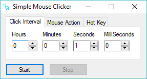
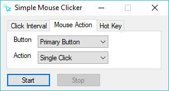
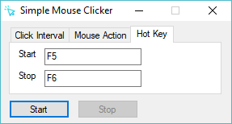

Simple Mouse Clicker is a free software that can automate your mouse clicking.

## Features
- Support mouse click interval.
- Support primary/secondary mouse button and single/double click action.
- Support customizable start/stop hotkey.
- Free and open-source.
- Minimal and easy-to-use.
- No malware, no virus and no ads.

## Screenshots

## Download
You can download the compiled standalone executable `Simple Mouse Clicker.exe` [here](https://github.com/chaohershi/simplemouseclicker/releases). No installation required.

## License
Simple Mouse Clicker is available under the MIT License.  
Simple Mouse Clicker icon made by [Kiranshastry](https://www.flaticon.com/authors/kiranshastry) from [Flaticon](https://www.flaticon.com/free-icon/cursor_876016) is licensed by [CC 3.0 BY](https://creativecommons.org/licenses/by/3.0/).
